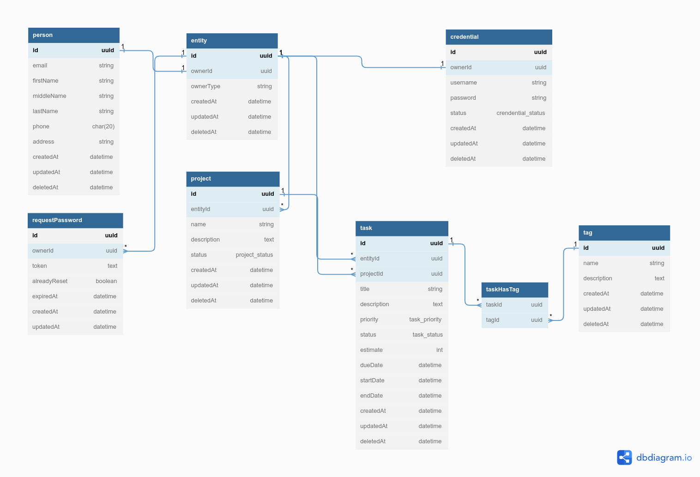

# ToDos Application API

## What we will have in this application?

### Authentication/Credential
- Register user to the application
- Reset password
- Forgot password
- User will have: uuid, first_name, last_name, created_at, updated_at, deleted_at
- Credential will have: uuid, user_id, username, password, created_at, updated_at, deleted_at
- Request Password:
  - The data will be store when request the password changed
  - Will have: uuid, owner_id, token, alreadReset, expiredAt, createdAt, updatedAt

### User with Project and Task
- User can have many projects
- User can have many tasks through project

### Project
- Start on the left hand side
- The project will have many todos board view
- CRUD a project
- Project will have: uuid, title, position, create_at, updated_at, deleted_at, publishedAt
- Project may be have multiple tags (**will implement in the future**)
- Project belongs to user

### Task
- CRUD a task
- Task belongs to project
- Task belongs to user through project
- Task will have many tags
- Task will have one priority
- Task will have: uuid, priority_id, project_id, title, description, status, start_time, end_time, created_at, updated_at, deleted_at

    - Status will be open, in-progress, completed and archived
        - Backlog: task stay back and will be 
        - Open: new task
        - In-progress: working task
        - Completed: complete task
        - Archived: archive task. We will have a link or a button that direct to archived list view and can recover a archived task

- Estimate time: estimate the time to complete the task, store in database as minute --> will convert to `x day y hour z minute v seconds`
- Start date: the date where the task will be start
- End date: the date where the task will be end
- Due date: the real date that the task will be completed and deliver to client

- Priority will have the level from 0 to 5
  - 0
  - 1
  - 2
  - 3
  - 4
  - 5

### Tag
- CRUD a tag
- Tag belongs to user
- Tag will have: uuid, user_id, title, color, created_at, updated_at, deleted_at
- Tag belong to many tasks => we will have a taggable

### Task Has Tag
- Task can have many tags
- TaskHasTag will have: uuid, task_id, tag_id

## Postgres Configuration

### What is the pool in the database configuration?
`pool` is optional, it will be used for Sequelize connection pool configuration
- `max`: maximum number of connection in pool
- `min`: minimum number of connection in pool
- `idle`: maximum time, in milliseconds, that a connection can be idle before being released
- `acquire`: maximum time, in milliseconds, that pool will try to get connection before throwing error

## What a technical achieve in this application?

### Common
- Typescript
- NodeJS
- ExpressJS
- Sequelize
- PostgreSQL

## Database

### DBDiagram
- [TODOS Database](https://dbdiagram.io/d/63c7b3a2296d97641d7a69bc)

### INSTALLATION NOTE
- Copy from file base.toml to development.toml that can run the source in the local
- If we are running in the PROD, we need to set the process.env.NODE_ENV

### TODOs:
- We need to create custom migration file
